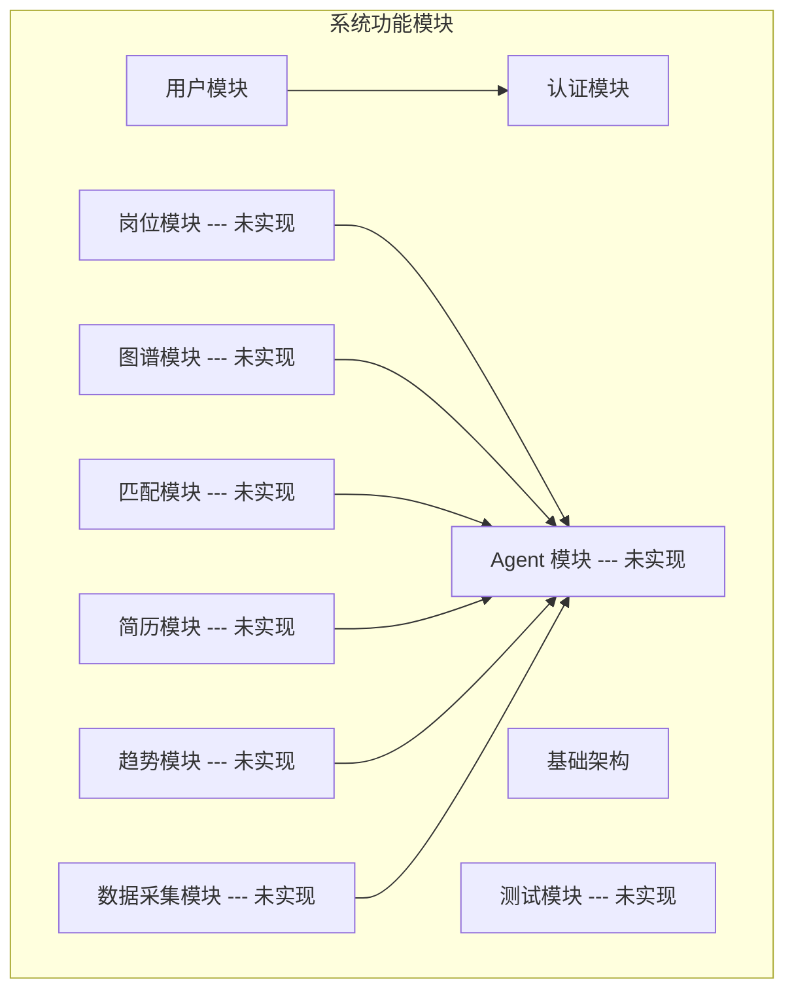
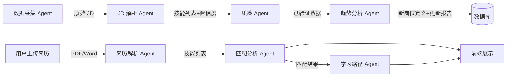
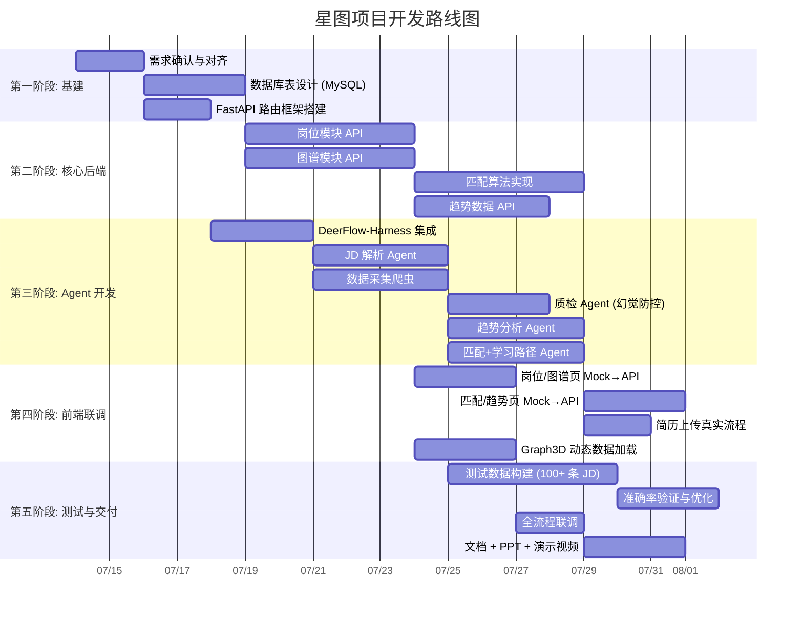
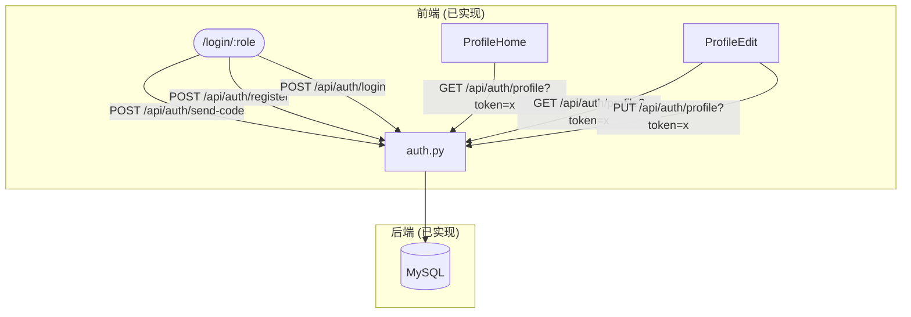
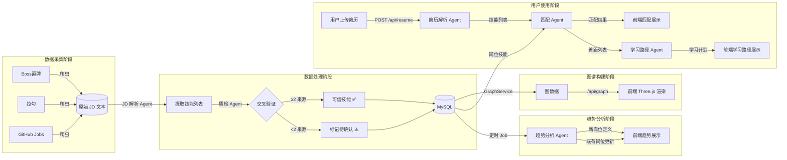
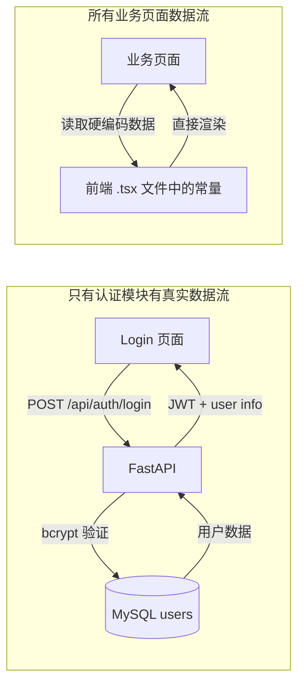

# 星图（XINGTU）系统完整架构分析报告

> **分析者角色**: 软件架构师 / Tech Lead / PM  
> **分析基准**: 全部源码 (`backend/`, `frontend/`)、设计文档 (`docs/`)、配置文件  
> **分析日期**: 2026-07-13  
> **核心发现**: 当前代码库是**原型阶段**——前端全为硬编码 Mock 数据，后端仅有 Auth 模块，与 `docs/` 中描述的完整架构存在巨大差距。

---

# 1. 项目概览

## 1.1 项目目标

构建一个"多源异构数据 + 大模型 + 知识图谱"驱动的**岗位能力图谱动态演化与分析系统**。核心解决两类用户的信息不对称：

- **求职者**: 不知道有什么岗位、不知道跟岗位差什么、不知道学什么方向
- **企业 HR**: 不会写新岗位 JD、JD 跟不上变化、不知道怎么定薪资

## 1.2 主要业务

```
多源数据采集 (Boss直聘 / 拉勾 / GitHub Jobs)
    ↓
新岗位发现与定义  ← →  既有岗位能力动态更新
    ↓
能力全景图谱可视化 (技能级粒度)
    ↓
简历解析 (PDF/Word)  →  人岗匹配诊断  →  差距分析
    ↓
针对性改进建议 + 岗位学习路径规划
```

## 1.3 当前实际技术栈

| 层级 | 实际使用 | 备注 |
|------|---------|------|
| **前端框架** | React 19 + Vite 5 + TypeScript 5.2 | |
| **前端 UI** | TailwindCSS 3.4 | 纯 CSS 变量主题，无 Ant Design |
| **3D 可视化** | Three.js (`@react-three/fiber` 9.x) | 硬编码数据展示 |
| **图表** | Recharts 2.15 | 硬编码数据展示 |
| **动画** | Framer Motion 12 + GSAP 3.15 | |
| **后端框架** | FastAPI 0.115+ (Python 3.12) | |
| **ORM** | SQLAlchemy 2.0 + PyMySQL | |
| **数据库** | MySQL 8.0 | `docs/` 写 PostgreSQL，实际用 MySQL |
| **认证** | JWT (PyJWT) + bcrypt | Token 通过 query param 传递 |
| **Agent 引擎** | 未集成 | `docs/` 规划 DeerFlow-Harness，代码中不存在 |
| **大模型** | 未集成 | `docs/` 规划 DeepSeek，代码中不存在 |
| **容器化** | Docker + Docker Compose | 已验证可运行 |
| **爬虫** | 未实现 | `docs/` 规划 httpx+BeautifulSoup |

## 1.4 架构差距分析

`docs/02-系统架构设计.md` 描述的目标架构 vs 当前代码实际情况：

| 维度 | 目标架构 (docs) | 当前代码 | 差距 |
|------|----------------|----------|------|
| 数据库 | PostgreSQL 16 | MySQL 8.0 | 不一致 |
| 后端路由 | `/api/jobs`, `/api/match`, `/api/graph`, `/api/resume`, `/api/trend`, `/api/agent` | 仅 `/api/auth/*` 和 `/api/health` | ⚠️ 6 个路由缺失 |
| 业务服务层 | JobService / MatchService / GraphService / TrendService | 不存在 | ⚠️ 全部缺失 |
| Agent 层 | 6 个 Agent (DeerFlow-Harness) | 不存在 | ⚠️ 全部缺失 |
| 前端数据 | 来自 API | 全部硬编码 Mock | ⚠️ 无真实 API 调用 |
| 爬虫 | httpx + BeautifulSoup | 不存在 | ⚠️ 缺失 |
| 定时任务 | APScheduler | 不存在 | ⚠️ 缺失 |
| 测试 | 测试框架 + ≥100 条测试数据 | 不存在 | ⚠️ 缺失 |

**结论**: 当前项目处于**界面原型阶段**。核心业务逻辑（数据处理、Agent 调用、图谱构建、匹配算法）均未实现。

## 1.5 Mermaid 架构图

```mermaid
graph TB
    subgraph "前端层 (React 19 + Vite)"
        A[角色选择 /login/:role]
        B[求职者 Shell]
        C[企业 Shell]
        D[工作台 Dashboard]
        E[岗位浏览 Jobs]
        F[技能图谱 SkillGraph]
        G[简历上传 Resume]
        H[人岗匹配 Match]
        I[学习路径 LearningPath]
        J[趋势洞察 Trend]
        K[岗位管理 JobManage]
        L[人才搜索 TalentSearch]
        M[市场洞察 MarketInsight]
        N[行业报告 IndustryReport]
        B --> D & E & F & G & H & I & J
        C --> K & L & M & N
    end

    subgraph "后端层 (FastAPI)"
        O[/api/auth/ 认证模块]
        P[/api/jobs/ 岗位模块 --- 未实现]
        Q[/api/match/ 匹配模块 --- 未实现]
        R[/api/graph/ 图谱模块 --- 未实现]
        S[/api/resume/ 简历模块 --- 未实现]
        T[/api/trend/ 趋势模块 --- 未实现]
    end

    subgraph "智能体层 --- 未实现"
        U[数据采集 Agent]
        V[JD解析 Agent]
        W[质检 Agent]
        X[趋势分析 Agent]
        Y[匹配分析 Agent]
        Z[学习路径 Agent]
    end

    subgraph "数据层"
        DB[(MySQL 8.0)]
    end

    A --> O
    B --> O
    C --> O
    O --> DB

    style P fill:#f96,stroke:#333,stroke-width:2px
    style Q fill:#f96,stroke:#333,stroke-width:2px
    style R fill:#f96,stroke:#333,stroke-width:2px
    style S fill:#f96,stroke:#333,stroke-width:2px
    style T fill:#f96,stroke:#333,stroke-width:2px
    style U fill:#f96,stroke:#333,stroke-width:2px
    style V fill:#f96,stroke:#333,stroke-width:2px
    style W fill:#f96,stroke:#333,stroke-width:2px
    style X fill:#f96,stroke:#333,stroke-width:2px
    style Y fill:#f96,stroke:#333,stroke-width:2px
    style Z fill:#f96,stroke:#333,stroke-width:2px
```

## 1.6 项目目录结构

```
XINGTU/
├── backend/                  # Python FastAPI 后端
│   ├── main.py               # 入口: FastAPI app + CORS + 路由注册
│   ├── database.py           # 数据库模型 (User, VerifyCode) + JWT 工具
│   ├── auth.py               # 认证路由: 注册/登录/验证码/个人资料
│   ├── requirements.txt      # Python 依赖 (9 个包)
│   ├── Dockerfile            # Python 3.12-slim 构建
│   └── .env.example          # 环境变量模板
│
├── frontend/                 # React + Vite + TypeScript 前端
│   ├── src/
│   │   ├── main.tsx          # 入口: BrowserRouter + ThemeProvider
│   │   ├── App.tsx           # 路由 + 登录状态管理
│   │   ├── index.css         # 全局样式 + 主题变量 (light/dark)
│   │   ├── components/
│   │   │   ├── JobseekerShell.tsx   # 求职者导航框架
│   │   │   ├── EnterpriseShell.tsx  # 企业导航框架
│   │   │   ├── Graph3D.tsx          # Three.js 3D 图谱组件 (硬编码)
│   │   │   ├── PageContainer.tsx    # 页面容器
│   │   │   ├── ThemeProvider.tsx    # 主题切换 (light/dark)
│   │   │   └── ui/                  # UI 组件库
│   │   ├── pages/
│   │   │   ├── RoleSelect.tsx       # 角色选择页
│   │   │   ├── Login.tsx            # 登录/注册页 (有真实 API 调用!)
│   │   │   ├── jobseeker/           # 求职者页面 (全部 Mock)
│   │   │   │   ├── Dashboard.tsx
│   │   │   │   ├── Jobs.tsx
│   │   │   │   ├── SkillGraph.tsx
│   │   │   │   ├── Resume.tsx
│   │   │   │   ├── Match.tsx
│   │   │   │   ├── LearningPath.tsx
│   │   │   │   ├── Trend.tsx
│   │   │   │   ├── ProfileHome.tsx  (# 有真实 API 调用!)
│   │   │   │   ├── ProfileEdit.tsx  (# 有真实 API 调用!)
│   │   │   │   └── MySkillGraphPage.tsx
│   │   │   └── enterprise/          # 企业页面 (全部 Mock)
│   │   │       ├── Dashboard.tsx
│   │   │       ├── JobManage.tsx
│   │   │       ├── TalentSearch.tsx
│   │   │       ├── MarketInsight.tsx
│   │   │       └── IndustryReport.tsx
│   │   ├── lib/utils.ts      # cn() 工具函数
│   │   └── types/index.ts    # TypeScript 类型定义 (设计的但未使用)
│   ├── package.json
│   ├── vite.config.ts        # Vite 配置 + /api 代理
│   ├── tsconfig.json         # @/* 路径别名
│   ├── tailwind.config.js
│   ├── postcss.config.js
│   ├── nginx.conf            # 生产: 代理 /api/ → api:8081
│   ├── Dockerfile            # node:20 → nginx:alpine
│   └── index.html
│
├── docs/                     # 设计文档 (与当前代码差距大)
│   ├── 00-基本信息.md          # 演示地址 + 人员分工
│   ├── 01-赛题深度解读与痛点分析.md  # 赛题要求详细分析
│   ├── 02-系统架构设计.md       # 目标架构 (含 Agent/PostgreSQL/爬虫)
│   ├── 02-技术选型之DeerFlow的作用.md  # DeerFlow 设计文档
│   └── 需要解决的问题方向.pdf
│
├── docker-compose.yml        # MySQL 8.0 + API + Frontend
├── AGENTS.md                 # OpenCode 辅助文档
├── README.md                 # 项目 README
└── .gitignore

```

---

# 2. 功能模块拆分

## 2.1 模块层级总图



## 2.2 已实现模块

### 模块 1: 用户模块

| 维度 | 内容 |
|------|------|
| **模块作用** | 用户注册、登录、信息管理、角色管理 |
| **当前状态** | ✅ 已实现 (backend/database.py + auth.py) |
| **主要功能** | 邮箱注册、邮箱密码登录、验证码发送、个人资料 CRUD |
| **输入** | 邮箱/手机号、密码、验证码、个人资料字段 |
| **输出** | JWT Token、用户信息 JSON、个人资料 JSON |
| **依赖** | MySQL (users 表, verify_codes 表) |
| **负责人建议** | 后端开发 (已有代码，维护即可) |

### 模块 2: 认证模块

| 维度 | 内容 |
|------|------|
| **模块作用** | JWT 生成与验证、权限校验 |
| **当前状态** | ✅ 已实现 (backend/database.py:72-82) |
| **主要功能** | JWT Token 签发 (7天过期)、Token 验证、角色校验 |
| **输入** | user_id, role, JWT_SECRET |
| **输出** | JWT Token (HS256) / 解码后的 payload |
| **设计问题** | Token 通过 query param 传递 (`?token=...`)，非标准做法 |
| **负责人建议** | 后端开发 (维护，不建议重构 unless 全局协调) |

## 2.3 未实现但前端页面已完成的模块

### 模块 3: 岗位模块

| 维度 | 内容 |
|------|------|
| **模块作用** | 岗位数据浏览、搜索、详情展示 |
| **当前状态** | ❌ 后端未实现，前端硬编码 Mock 数据 |
| **主要功能** | 岗位列表展示、关键词搜索、按技能筛选、薪资范围筛选 |
| **前端页面** | `frontend/src/pages/jobseeker/Jobs.tsx` (硬编码 8 个岗位) |
| **预期路由** | `GET /api/jobs`, `GET /api/jobs/{id}`, `POST /api/jobs/search` |
| **负责人建议** | 后端优先实现，前端联调替换 Mock |

### 模块 4: 图谱模块

| 维度 | 内容 |
|------|------|
| **模块作用** | 岗位-技能关系可视化展示 |
| **当前状态** | ❌ 后端未实现，前端 Three.js 硬编码 |
| **主要功能** | 3D 力导向图展示、节点点击聚焦、分类筛选 |
| **前端文件** | `Graph3D.tsx` (20 个节点、24 条边完全硬编码) |
| **预期路由** | `GET /api/graph/nodes`, `GET /api/graph/edges` |
| **设计问题** | Three.js 重渲染问题 - 每次组件挂载创建新 Scene |
| **负责人建议** | 需后端提供图数据 API，前端改为动态加载 |

### 模块 5: 匹配模块

| 维度 | 内容 |
|------|------|
| **模块作用** | 人岗匹配度诊断与差距分析 |
| **当前状态** | ❌ 后端未实现，前端硬编码 Mock |
| **主要功能** | 匹配度评分 (4维度)、技能差距展示、改进建议 |
| **前端页面** | `Match.tsx` (硬编码匹配分 72，维度: 技能/经验/学历/薪资) |
| **预期路由** | `POST /api/match`, `POST /api/match/analyze` |
| **负责人建议** | 需 Agent 模块配合，复杂度高 |

### 模块 6: 简历模块

| 维度 | 内容 |
|------|------|
| **模块作用** | 简历上传、解析、技能提取 |
| **当前状态** | ❌ 后端未实现，前端模拟上传流程 |
| **主要功能** | PDF/Word 上传、AI 解析、技能提取 |
| **前端页面** | `Resume.tsx` (模拟 2 秒解析) |
| **预期路由** | `POST /api/resume/upload`, `GET /api/resume/{id}` |
| **负责人建议** | 依赖文件存储 + 大模型 Agent，复杂度高 |

### 模块 7: 趋势模块

| 维度 | 内容 |
|------|------|
| **模块作用** | 技能需求趋势分析、新岗位发现、既有岗位更新 |
| **当前状态** | ❌ 后端未实现，前端 Recharts 硬编码 |
| **主要功能** | 技能趋势折线图、薪资分布柱状图、新兴岗位增长排行 |
| **前端页面** | `Trend.tsx` (硬编码 6 个月的 5 个技能趋势数据) |
| **预期路由** | `GET /api/trend/skills`, `GET /api/trend/discoveries`, `GET /api/trend/updates` |
| **负责人建议** | 需 Agent 模块 + 定时任务配合 |

### 模块 8: Agent 模块 (核心创新点)

| 维度 | 内容 |
|------|------|
| **模块作用** | 大模型 Agent 编排，实现 JD解析/质检/匹配/趋势分析/学习路径 |
| **当前状态** | ❌ 未实现，`docs/` 中有详细设计 |
| **预期技术** | DeerFlow-Harness + DeepSeek API |
| **主要 Agent** | 数据采集 Agent / JD 解析 Agent / 质检 Agent / 趋势分析 Agent / 匹配分析 Agent / 学习路径 Agent |
| **负责人建议** | 需专门 Agent 开发人员，是项目技术难点 |

### 模块 9: 数据采集模块

| 维度 | 内容 |
|------|------|
| **模块作用** | 从多源招聘网站爬取 JD 数据 |
| **当前状态** | ❌ 未实现 |
| **预期技术** | httpx + BeautifulSoup |
| **数据源** | Boss直聘 / 拉勾 / GitHub Jobs |
| **负责人建议** | 爬虫专项开发 |

---

# 3. 模块详细设计

## 3.1 用户 / 认证模块（已实现）

### 数据流

```
用户 → POST /api/auth/register → 验证码校验 → bcrypt 加密 → 写入 DB users 表 → 返回成功
用户 → POST /api/auth/login → bcrypt 验证 → JWT 签发 → 返回 token + user 信息
前端 → ?token=xxxx → verify_token() → JWT 解码 → 业务处理
```

### 数据库表

**users 表** — 已实现

| 字段 | 类型 | 用途 | 问题 |
|------|------|------|------|
| id | INT PK AUTO_INCREMENT | 主键 | |
| email | VARCHAR(200) UNIQUE | 登录邮箱 | Nullable, 与 phone 二选一 |
| phone | VARCHAR(50) UNIQUE | 登录手机号 | Nullable, 但注册接口只支持邮箱 |
| username | VARCHAR(100) | 显示名称 | 默认取邮箱前缀 |
| password | VARCHAR(200) | bcrypt 哈希密码 | |
| role | VARCHAR(20) | jobseeker/enterprise | |
| avatar | VARCHAR(500) | 头像 URL | 未使用 |
| real_name ~ bio | 多个字段 | 个人信息 | 全部在一张表，无业务表分离 |

**verify_codes 表** — 已实现

| 字段 | 类型 | 用途 |
|------|------|------|
| id | INT PK AUTO_INCREMENT | 主键 |
| target | VARCHAR(200) | 邮箱地址 |
| code | VARCHAR(10) | 6 位验证码 |
| created_at | DateTime | 创建时间 |

### 设计问题识别

1. **密码验证码合在同一表**: `age` 字段用 `Integer` 但页面用字符串传输，有类型转换风险
2. **SMTP 凭证硬编码**: `auth.py:9` 明文写 QQ 邮箱密码，安全隐患
3. **Token 通过 query param**: 非 RESTful 标准，URL 会记录在服务器日志中
4. **无 refresh token**: Token 7 天过期后用户需重新登录
5. **verify_codes 无过期策略**: 理论上旧的验证码可以一直使用

### 改进方案

```python
# 推荐: 将 SMTP 凭证移至环境变量
SMTP_HOST = os.getenv('SMTP_HOST', 'smtp.qq.com')
SMTP_USER = os.getenv('SMTP_USER')
SMTP_PASS = os.getenv('SMTP_PASS')
# 如果未设置 SMTP，直接输出验证码到日志(开发模式)
```

## 3.2 岗位模块（需新建）

### 期望数据模型

```python
class Job(Base):
    __tablename__ = 'jobs'
    id = Column(Integer, primary_key=True)
    title = Column(String(200), nullable=False)
    company = Column(String(200))
    location = Column(String(100))
    salary_min = Column(Integer)
    salary_max = Column(Integer)
    education = Column(String(50))
    experience = Column(String(50))
    description = Column(Text)
    source = Column(String(50))        # boss/lagou/github
    source_url = Column(String(500))
    collected_at = Column(DateTime)
    created_at = Column(DateTime, default=func.now())

class JobSkill(Base):
    __tablename__ = 'job_skills'
    id = Column(Integer, primary_key=True)
    job_id = Column(Integer, ForeignKey('jobs.id'))
    skill_name = Column(String(100))
    skill_category = Column(String(50))
    confidence = Column(Float)          # 置信度
    source_count = Column(Integer)      # 多源验证次数
```

### 关键接口

| 接口 | 方法 | 说明 |
|------|------|------|
| `/api/jobs` | GET | 岗位列表，支持分页/搜索/筛选 |
| `/api/jobs/{id}` | GET | 岗位详情，包含技能列表 |
| `/api/jobs/search` | POST | 高级搜索 |
| `/api/jobs/stats` | GET | 统计数据 (总量/平均薪资) |

## 3.3 图谱模块（需新建）

### 期望数据模型

```python
class GraphNode(Base):
    __tablename__ = 'graph_nodes'
    id = Column(Integer, primary_key=True)
    name = Column(String(100))
    type = Column(String(20))      # 'job' | 'skill'
    category = Column(String(50))  # AI/后端/数据/运维
    level = Column(Integer)        # 难度级别
    weight = Column(Float)         # 重要性

class GraphEdge(Base):
    __tablename__ = 'graph_edges'
    id = Column(Integer, primary_key=True)
    source_id = Column(Integer, ForeignKey('graph_nodes.id'))
    target_id = Column(Integer, ForeignKey('graph_nodes.id'))
    relation = Column(String(50))  # 'requires' | 'related_to'
    weight = Column(Float)
    period = Column(String(20))    # 时间段，用于追踪变化
```

## 3.4 Agent 模块设计（docs 规划）



---

# 4. 项目分工方案

## 4.1 核心原则

- 当前项目**前端 UI 已基本完成**（除真实 API 联调），核心工作在后端 + Agent
- 所有分工都需以 **docs/01-赛题深度解读与痛点分析.md** 的评分标准为导向

## 4.2 2 人团队

| 负责人 | 模块 | 工作内容 | 输出成果 | 依赖模块 | 优先级 | 预估工作量 |
|--------|------|---------|---------|---------|--------|-----------|
| 人员 A | 后端基础 + 岗位/图谱 API | 搭建 FastAPI 路由层、实现 Job CRUD、Graph 数据 API、数据库迁移 | `routers/jobs.py`, `routers/graph.py`, `models/*` | 无 | P0 | 1.5 周 |
| 人员 B | Agent 模块 + 数据采集 | 集成 DeerFlow-Harness、实现 JD 解析 Agent、数据采集爬虫 | `services/*`, `agents/*`, `scripts/crawl_jobs.py` | 后端基础 | P0 | 2 周 |
| 人员 A | 匹配/趋势 API | 实现 Match 计算、Trend 数据 API | `routers/match.py`, `routers/trend.py` | Agent 模块 | P1 | 1 周 |
| 人员 B | 简历解析 + 前端联调 | 实现简历上传解析、替换前端 Mock 数据 | `routers/resume.py`, 前端 API 对接 | Agent 模块 | P1 | 1 周 |

**评价**: 2 人团队极度紧张，建议优先做评分占比最高的"图谱可视化 + 匹配分析"链路。

## 4.3 4 人团队 (推荐最小配置)

| 负责人 | 模块 | 工作内容 | 输出成果 | 依赖 | 优先级 | 工作量 |
|--------|------|---------|---------|------|--------|-------|
| 人员 1 | 后端基础架构 | FastAPI 路由搭建、数据库模型设计、用户认证维护、Health API | 项目基建 | 无 | P0 | 1 周 |
| 人员 2 | 岗位 + 图谱模块 | Job CRUD API、Graph Node/Edge API、3D 图谱数据适配 | 后端 Job/Graph 接口 | 人员 1 | P0 | 2 周 |
| 人员 3 | Agent 引擎 | DeerFlow-Harness 集成、JD 解析 Agent、质检 Agent | Agent 框架 + 2 个 Agent | 人员 1 | P0 | 2 周 |
| 人员 4 | 匹配 + 趋势 + 简历 | 匹配算法、趋势分析、简历上传解析、前端 Mock 数据替换 | 匹配/趋势/简历 API | 人员 3 | P0 | 2 周 |
| 全部 | 联调 + 测试 | 全流程联调、测试数据构建、准确率验证、PPT/文档 | 完整可运行系统 | 全部完成 | P1 | 1 周 |

## 4.4 6 人团队

| 负责人 | 模块 | 工作内容 | 依赖 | 优先级 | 工作量 |
|--------|------|---------|------|--------|-------|
| 人员 1 | 后端基础 + 部署 | FastAPI 框架、Docker 优化、CI/CD、数据库管理 | 无 | P0 | 1 周 |
| 人员 2 | 岗位模块 | Job CRUD + 搜索 + 数据迁移脚本 | 人员 1 | P0 | 1.5 周 |
| 人员 3 | 图谱模块 | Graph API + 图谱数据构建 + Three.js 动态数据适配 | 人员 1,2 | P0 | 1.5 周 |
| 人员 4 | Agent 引擎 + 数据采集 | DeerFlow 集成 + 爬虫 (Boss/拉勾/GitHub) | 人员 1 | P0 | 2 周 |
| 人员 5 | 匹配 + 学习路径 Agent | 匹配 Agent + 学习路径 Agent + 差距分析 | 人员 4 | P0 | 2 周 |
| 人员 6 | 前端联调 + 测试 | 前端 Mock→真实 API 替换、测试数据构建和验证 | 全部完成 | P0 | 2 周 |

## 4.5 8 人团队

在 6 人基础上增加：

| 负责人 | 模块 | 工作内容 | 依赖 |
|--------|------|---------|------|
| 人员 7 | 质检 Agent + 幻觉防控 | 多源交叉验证、置信度评分、抄袭/通胀检测 | 人员 4 |
| 人员 8 | 文档 + 测试 + 演示 | 测试数据标注、测试脚本、PPT、演示视频 | 全部 |

---

# 5. 开发路线

## 5.1 开发阶段总图



## 5.2 详细路线

### 第一阶段: 基建 (第 1 周)

| 任务 | 描述 | 负责人建议 |
|------|------|-----------|
| 需求对齐 | 全员阅读 docs/*，对齐赛题要求 | 全员 |
| 数据库设计 | 创建 jobs, job_skills, graph_nodes, graph_edges, match_records 表 | 后端 |
| FastAPI 框架 | 创建 routers/ 目录结构、配置 CORS、添加公共中间件 | 后端 |
| 数据库迁移 | 从 `Base.metadata.create_all()` 改为 Alembic 或手动 SQL | 后端 |

### 第二阶段: 核心业务后端 (第 2-3 周)

| 任务 | 描述 |
|------|------|
| 岗位 API | `/api/jobs` CRUD + 搜索 + 分页 |
| 图谱 API | `/api/graph/nodes`, `/api/graph/edges` 动态数据 |
| 匹配计算 | 纯规则匹配 (技能交集/Jaccard 相似度) 先跑通，再集成 Agent |
| 趋势 API | `/api/trend` 统计接口 |

### 第三阶段: Agent 与数据 (第 2-4 周，与第二阶段并行)

| 任务 | 描述 | 难点 |
|------|------|------|
| DeerFlow 集成 | 配置 DeerFlow Client | 需 API Key |
| JD 解析 Agent | 从 JD 文本提取技能列表 | 准确率 ≥ 90% |
| 爬虫 | 爬取 ≥100 条 JD 作为测试数据 | 反爬机制 |
| 质检 Agent | 多源交叉验证 | 核心技术点 |
| 匹配 Agent | 基于 LLM 的智能匹配 | 与规则匹配协同 |

### 第四阶段: 前端联调 (第 3-4 周)

| 任务 | 描述 |
|------|------|
| Jobs 页联调 | 替换硬编码数据为 `/api/jobs` 调用 |
| SkillGraph 联调 | Graph3D 从 `/api/graph` 加载数据 |
| Match 联调 | 对接真实匹配 API |
| Trend 联调 | 对接趋势 API |
| 登录 Bug 修复 | `App.tsx:32` 的 `demo_token` 覆盖问题 |

### 第五阶段: 测试与交付 (第 5-6 周)

| 任务 | 描述 | 验收标准 |
|------|------|---------|
| 测试数据 | 100 条 JD + 100 份模拟简历 | ✅ 三项准确率 ≥ 90% |
| 全流程测试 | 采集→解析→质检→图谱→匹配→学习路径 | ✅ 无断链 |
| 文档 | 设计文档 + PPT + 演示视频 | ✅ 提交材料齐全 |
| 部署 | Docker Compose 一键启动 | ✅ 可部署运行 |

---

# 6. 接口调用关系

## 6.1 当前真实调用关系



**问题**: 前端其他 10+ 页面全部使用硬编码数据，不调用任何 API。

## 6.2 设计中的完整调用关系

```mermaid
graph TB
    subgraph "前端页面"
        Jobs[岗位浏览] --> GET[/api/jobs]
        JobDetail[岗位详情] --> GET[/api/jobs/{id}]
        SkillGraph[技能图谱] --> GET[/api/graph/nodes]
        SkillGraph --> GET[/api/graph/edges]
        Resume[简历上传] --> POST[/api/resume/upload]
        Match[人岗匹配] --> POST[/api/match]
        Match --> POST[/api/match/analyze]
        LearningPath[学习路径] --> POST[/api/match/learning-path]
        Trend[趋势洞察] --> GET[/api/trend/skills]
        Trend --> GET[/api/trend/discoveries]
        Trend --> GET[/api/trend/updates]
        EnterpriseTalent[人才搜索] --> GET[/api/jobs/candidates]
        EnterpriseMarket[市场洞察] --> GET[/api/trend/market]
    end

    subgraph "后端路由"
        JobsRouter[/api/jobs] --> JobService[JobService]
        GraphRouter[/api/graph] --> GraphService[GraphService]
        MatchRouter[/api/match] --> MatchService[MatchService]
        ResumeRouter[/api/resume] --> ResumeService[ResumeService]
        TrendRouter[/api/trend] --> TrendService[TrendService]
    end

    subgraph "Agent 层"
        JobService --> JDAgent[JD 解析 Agent]
        MatchService --> MatchAgent[匹配分析 Agent]
        MatchService --> LearnAgent[学习路径 Agent]
        TrendService --> TrendAgent[趋势分析 Agent]
        TrendService --> QualityAgent[质检 Agent]
    end

    subgraph "数据层"
        JDAgent --> DB[(MySQL)]
        TrendAgent --> DB
        QualityAgent --> DB
    end

    subgraph "外部"
        Crawler[数据采集爬虫] --> JDAgent
        LLM[DeepSeek API] --> JDAgent
        LLM --> MatchAgent
        LLM --> TrendAgent
    end
```

## 6.3 循环依赖分析

| 依赖环 | 风险 | 建议 |
|--------|------|------|
| 无循环依赖 | 当前架构为分层调用，无环 | — |
| Agent → LLM → Agent | 间接环，但属正常 | 设置 Token 预算上限防止级联失败 |

## 6.4 最核心接口

| 接口 | 重要性 | 原因 |
|------|--------|------|
| `POST /api/match` | ⭐⭐⭐⭐⭐ | 评分标准核心功能，直接影响 30 分 |
| `GET /api/graph/nodes+edges` | ⭐⭐⭐⭐⭐ | 图谱展示，直接影响 15 分(用户体验) |
| `GET /api/trend/discoveries` | ⭐⭐⭐⭐ | 新岗位发现，影响 30 分(完整性) |
| `POST /api/resume/upload` | ⭐⭐⭐⭐ | 简历解析，三项 90% 指标之一 |

## 6.5 最容易修改的接口

| 接口 | 原因 |
|------|------|
| `/api/jobs` | 纯粹的 CRUD，无 Agent 依赖 |
| `/api/graph` | 只查询不写入，逻辑简单 |
| `/api/auth/*` | 已实现，只需维护 |

---

# 7. 数据流分析

## 7.1 完整数据流



## 7.2 当前实际数据流



---

# 8. 数据库分析

## 8.1 当前表 (已实现)

### `users` 表

| 字段 | 类型 | 用途 | 约束 | 核心? |
|------|------|------|------|-------|
| id | INT | 用户主键 | PK, AUTO_INCREMENT | ✅ |
| email | VARCHAR(200) | 登录邮箱 | UNIQUE, NULLABLE | ✅ |
| phone | VARCHAR(50) | 登录手机号 | UNIQUE, NULLABLE | |
| username | VARCHAR(100) | 显示名称 | DEFAULT '' | |
| password | VARCHAR(200) | bcrypt 哈希 | NOT NULL | ✅ |
| role | VARCHAR(20) | jobseeker/enterprise | NOT NULL | ✅ |
| avatar | VARCHAR(500) | 头像 URL | | |
| real_name | VARCHAR(100) | 真实姓名 | | |
| gender | VARCHAR(10) | 性别 | | |
| age | Integer | 年龄 | NULLABLE | |
| education | VARCHAR(50) | 最高学历 | | |
| school | VARCHAR(200) | 毕业院校 | | |
| city | VARCHAR(100) | 所在城市 | | |
| target_city | VARCHAR(100) | 目标城市 | | |
| expected_salary | VARCHAR(50) | 期望薪资 | | |
| target_position | VARCHAR(200) | 目标岗位 | | |
| experience | VARCHAR(100) | 工作经验 | | |
| skills | VARCHAR(500) | 技能列表 | 逗号分隔字符串 | |
| bio | VARCHAR(500) | 个人简介 | | |
| created_at | DateTime | 创建时间 | DEFAULT now() | |
| updated_at | DateTime | 更新时间 | ON UPDATE now() | |

### `verify_codes` 表

| 字段 | 类型 | 用途 | 约束 |
|------|------|------|------|
| id | INT | 主键 | PK, AUTO_INCREMENT |
| target | VARCHAR(200) | 邮箱地址 | NOT NULL |
| code | VARCHAR(10) | 6 位验证码 | NOT NULL |
| created_at | DateTime | 发送时间 | DEFAULT now() |

## 8.2 需新建的表

### `jobs` — 核心业务表

| 字段 | 类型 | 用途 | 索引建议 |
|------|------|------|---------|
| id | INT PK | 主键 | |
| title | VARCHAR(200) | 岗位名称 | INDEX |
| company | VARCHAR(200) | 公司名称 | INDEX |
| location | VARCHAR(100) | 工作地点 | INDEX |
| salary_min | INT | 最低薪资 (K) | |
| salary_max | INT | 最高薪资 (K) | |
| education | VARCHAR(50) | 学历要求 | |
| experience | VARCHAR(50) | 经验要求 | |
| description | TEXT | JD 原文 | FULLTEXT |
| source | VARCHAR(50) | 数据来源 | INDEX |
| source_url | VARCHAR(500) | 原始 URL | |
| collected_at | DateTime | 采集时间 | INDEX |
| created_at | DateTime | 创建时间 | |

### `job_skills` — 核心业务表

| 字段 | 类型 | 用途 | 索引 |
|------|------|------|------|
| id | INT PK | 主键 | |
| job_id | INT FK→jobs.id | 关联岗位 | INDEX |
| skill_name | VARCHAR(100) | 技能名称 | INDEX |
| skill_category | VARCHAR(50) | 技能分类 | |
| confidence | FLOAT | 置信度 0-1 | |
| source_count | INT | 验证来源数 | |

### `graph_nodes` — 核心业务表

| 字段 | 类型 | 用途 |
|------|------|------|
| id | INT PK | 主键 |
| name | VARCHAR(100) | 节点名称 |
| type | VARCHAR(20) | job/skill |
| category | VARCHAR(50) | 分类 |
| level | INT | 级别 |
| weight | FLOAT | 权重 |

### `graph_edges` — 核心业务表

| 字段 | 类型 | 用途 |
|------|------|------|
| id | INT PK | 主键 |
| source_id | INT FK→nodes.id | 源节点 |
| target_id | INT FK→nodes.id | 目标节点 |
| relation | VARCHAR(50) | 关系类型 |
| weight | FLOAT | 权重 |
| period | VARCHAR(20) | 时间段 |

### `match_records` — 业务表

| 字段 | 类型 | 用途 |
|------|------|------|
| id | INT PK | 主键 |
| user_id | INT FK→users.id | 用户 |
| job_id | INT FK→jobs.id | 岗位 |
| match_score | FLOAT | 总匹配分 |
| skill_score | FLOAT | 技能维度分 |
| experience_score | FLOAT | 经验维度分 |
| education_score | FLOAT | 学历维度分 |
| salary_score | FLOAT | 薪资维度分 |
| matched_skills | TEXT | JSON 数组 |
| missing_skills | TEXT | JSON 数组 |
| advice | TEXT | 建议 |
| created_at | DateTime | 创建时间 |

## 8.3 核心表 vs 可拆分表

| 表 | 核心? | 说明 |
|----|-------|------|
| users | ✅ | 基础用户 |
| jobs | ✅ | 核心业务数据 |
| job_skills | ✅ | 岗位技能关联 |
| graph_nodes | ✅ | 图谱节点 |
| graph_edges | ✅ | 图谱边 |
| match_records | ✅ | 匹配记录 |
| verify_codes | ❌ | 可移入 Redis (临时数据) |
| 个人资料字段 | 建议拆分 | 从 users 表分拆为 `user_profiles` 表 |

## 8.4 设计问题

1. **users 表过于臃肿**: 个人资料字段 (15 个) 和认证字段 (6 个) 混在一张表，建议拆分为 `users`(认证) + `user_profiles`(资料) + `user_skills`(技能)
2. **skills 字段用逗号分隔字符串**: `VARCHAR(500)` 存 "Java,Python,Spring Boot"，违反第一范式，建议改为关联表
3. **无外键约束**: 当前代码中没有定义 `ForeignKey`，关联全靠业务逻辑维护，可能导致数据不一致

---

# 9. API 分析

## 9.1 当前已实现接口

### `GET /api/health`

| 维度 | 内容 |
|------|------|
| **用途** | 健康检查 |
| **参数** | 无 |
| **响应** | `{"status": "ok", "service": "xingtu-api"}` |
| **权限** | 无 |
| **优化建议** | 建议检查数据库连接 |

### `POST /api/auth/send-code`

| 维度 | 内容 |
|------|------|
| **用途** | 发送邮箱验证码 |
| **请求体** | `{"account": "string"}`
| **响应** | `{"success": true, "message": "..."}` |
| **权限** | 无 |
| **优化建议** | 添加频率限制 (60s)，验证码过期时间 |

### `POST /api/auth/register`

| 维度 | 内容 |
|------|------|
| **用途** | 邮箱注册 |
| **请求体** | `{"account": "string", "password": "string", "code": "string", "role": "jobseeker|enterprise"}`
| **响应** | `{"success": true, "message": "..."}` |
| **权限** | 无 |
| **优化建议** | 密码强度验证已实现 (大小写+数字+8位) ✅ |

### `POST /api/auth/login`

| 维度 | 内容 |
|------|------|
| **用途** | 登录，返回 JWT |
| **请求体** | `{"account": "string", "password": "string", "role": "string"}`
| **响应** | `{"success": true, "data": {user_info..., "token": "jwt..."}}` |
| **权限** | 无 |
| **优化建议** | 返回结构不一致 (`data` vs 其他接口直接返回字段) |

### `GET /api/auth/profile`

| 维度 | 内容 |
|------|------|
| **用途** | 获取个人资料 |
| **参数** | `?token=xxx` (Query) |
| **响应** | `{"success": true, "data": {user_fields...}}` |
| **权限** | JWT 验证 |
| **优化建议** | Token 应放在 Authorization Header |

### `PUT /api/auth/profile`

| 维度 | 内容 |
|------|------|
| **用途** | 更新个人资料 |
| **参数** | `?token=xxx` (Query)，请求体含所有字段 |
| **响应** | `{"success": true, "message": "保存成功"}` |
| **权限** | JWT 验证 |
| **优化建议** | 同 get_profile |

## 9.2 需新建的接口 (按优先级)

### P0: 赛题核心

| 接口 | 方法 | 用途 | 建议 |
|------|------|------|------|
| `/api/jobs` | GET | 岗位列表 | 支持 `?page&size&keyword&skill` 参数 |
| `/api/jobs/{id}` | GET | 岗位详情 | 含技能列表 |
| `/api/graph/nodes` | GET | 图谱节点 | 支持 `?type&category` 筛选 |
| `/api/graph/edges` | GET | 图谱边 | 支持 `?node_id` 筛选 |
| `/api/match` | POST | 执行匹配 | 请求体: `{user_id, job_id}` |
| `/api/match/result/{id}` | GET | 匹配结果 | |
| `/api/resume/upload` | POST | 上传简历 | multipart/form-data |

### P1: 完善功能

| 接口 | 方法 | 用途 |
|------|------|------|
| `/api/trend/skills` | GET | 技能趋势数据 |
| `/api/trend/discoveries` | GET | 新岗位发现列表 |
| `/api/trend/updates` | GET | 既有岗位更新列表 |
| `/api/match/learning-path` | POST | 生成学习路径 |
| `/api/jobs/search` | POST | 高级搜索 |

---

# 10. 项目风险分析

## 10.1 当前设计问题

### 严重问题

| 问题 | 位置 | 影响 | 建议 |
|------|------|------|------|
| **前端 Token 被覆写** | `App.tsx:32` | Profile 页面 API 调用使用 `demo_token`，导致认证失败 | 删除 `App.tsx:32-34` 的 `demo_token` 写入，让 Login 页面保持真实 Token |
| **SMTP 凭证硬编码** | `auth.py:9` | 安全风险，凭证泄露 | 移至环境变量 |
| **JWT 密钥默认值** | `database.py:73` | 生产环境安全风险 | 强制要求设置环境变量 |
| **无业务数据** | 所有页面 | 无法演示真实功能 | 需同步进行数据采集和 Mock 数据替换 |

### 中等问题

| 问题 | 位置 | 影响 | 建议 |
|------|------|------|------|
| **skills 字段用字符串** | `users.skills` VARCHAR(500) | 无法高效查询、无法建立索引 | 新建 `user_skills` 关联表 |
| **verify_codes 无过期** | `VerifyCode` 模型 | 验证码可被重复使用 | 添加 `expires_at` 字段，查询时过滤 |
| **跨域配置过于宽松** | `main.py:10` `allow_origins=['*']` | 安全风险 | 生产环境限定具体域名 |
| **无请求频率限制** | 所有接口 | 可被暴力攻击 | 添加 RateLimit 中间件 |
| **Three.js 内存泄漏** | `Graph3D.tsx` | 每次切换页面重新创建场景，旧场景未完全销毁 | 检查清理逻辑 (已有 `return` 清理，需测试) |

### 轻微问题

| 问题 | 位置 | 建议 |
|------|------|------|
| 前端无 loading 状态 | 大部分页面 | 添加 Skeleton 加载占位 |
| 类型定义未使用 | `types/index.ts` | 导入并使用 |
| 全局 CSS 字体过大 | `index.css` 全局字体放大 | 可能破坏某些组件布局 |
| 无统一 API 错误处理 | 前端 | 添加 axios/fetch 拦截器 |

## 10.2 项目交付风险

| 风险 | 概率 | 影响 | 应对 |
|------|------|------|------|
| Agent 集成失败 (DeerFlow 不可用) | 中 | 高 (25 分技术创新性) | 准备降级方案：纯规则匹配 + 直接调用 DeepSeek API |
| 三项 ≥ 90% 准确率不达标 | 中 | 高 (30 分实用价值) | 从第 1 天开始构建测试集，持续验证 |
| 爬虫反爬导致数据不足 | 高 | 中 (无法构建完整链路) | 准备第三路数据源 + 手动构建 Mock 数据 |
| 前端 Mock 替换延迟 | 中 | 中 | 后端 API 先出，Mock 数据与 API 返回结构对齐 |
| Docker 部署问题 | 低 | 中 | 提前测试 Docker Compose |

## 10.3 重构建议

### 短期可做 (1-2 天)

1. **修复 Token 覆盖 Bug**: 删除 `App.tsx:32-34`
2. **SMTP 凭证移至环境变量**: `auth.py:9`
3. **统一响应格式**: 让所有 API 返回 `{success, data, message}` 结构

### 中期 (3-5 天)

1. **数据库表拆分**: users 表拆分出 user_profiles + user_skills
2. **Graph3D 性能优化**: 使用 BufferGeometry 合并、LOD 分级加载
3. **添加请求频率限制**: FastAPI 中间件

### 长期 (项目结束后)

1. **Token 传参改为 Header**: 统一修改后端 + 所有前端调用方
2. **Alembic 迁移**: 从 `create_all()` 升级为正式迁移
3. **测试框架**: 添加 pytest + vitest

---

# 11. Git 协作建议

## 11.1 分支策略

- `main`: 稳定版本，始终可部署
- `develop`: 各自的zxy_dev分支
## 11.2 Commit 规范

```
<type>(<scope>): <subject>

type: feat | fix | refactor | docs | test | chore
scope: api | agent | frontend | crawler | db | auth | docker
```

示例:
```
feat(api): add jobs CRUD endpoints
fix(auth): correct token overwrite in App.tsx
test(agent): add JD parsing accuracy test with 100 samples
```

## 11.3 模块负责人

| 模块 | 分支命名 | 负责人 |
|------|---------|--------|
| 后端基础 | `feature/api-*` | 后端组 |
| Agent | `feature/agent-*` | Agent 组 |
| 前端 | `feature/frontend-*` | 前端组 |
| 爬虫 | `feature/crawler-*` | 数据组 |
| 测试 | `feature/test-*` | 测试组 |

## 11.4 Merge 规则

- PR 必须至少 1 人 Review
- 功能分支合并前必须通过本地测试
- 不允许直接 push 到 `main` 和 `develop`
- Commit 信息必须符合规范

---


# 总结性结论

1. **项目状态**: 前端 UI 原型 (80% 完成) + 后端认证 (20% 完成)，核心业务逻辑 (0% 完成)
2. **最大风险**: 时间不够。6 周时间需完成 3 个 Agent、爬虫、匹配算法、准确率验证
3. **最短路径**: 优先完成"图谱展示 + 人岗匹配"链路，确保评分最高的两个维度
4. **必须修复的 Bug**: `App.tsx:32` demo_token 覆盖 (导致 Profile 页面认证失败)
5. **数据库分歧**: `docs/` 写 PostgreSQL，实际用 MySQL，建议统一
6. **核心创新点**: 质检 Agent (多源交叉验证 + 幻觉防控)，也是评分最高的技术点
