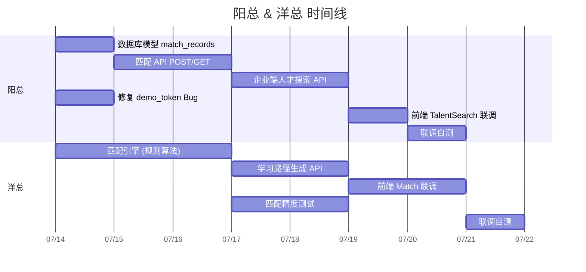

# 阳总 & 洋总 —— 分工推进文档

> **负责模块**: 人岗匹配设计 + 求职端匹配界面 + 企业端人才星界面  
> **关联模块**: 简历上传 (佳豪)、趋势分析 (我和吴家)、岗位数据 (静怡议桓)  
> **评分对应**: 作品完整性 30 分 + 实用价值 30 分 + 用户体验 15 分  
> **当前状态**: 前端页面已存在（全硬编码 Mock），后端完全未实现

---

## 一、核心链路总览

你们负责的模块处于整条链路的**中下游**，依赖上游数据：

```
上游 (其他人)             你们的核心链路                下游 (其他人)
静怡议桓: 岗位数据         简历 → 匹配 → 差距分析         佳豪: 幻觉防控
我和吴家: 趋势数据         企业端: 人才搜索                  
```

数据流：
```
用户技能 (手动填/简历解析)
     ↓  match_skills.py 计算
岗位技能 (来自数据库 jobs_skills 表)
     ↓
匹配分数 + 维度分析
     ↓
差距列表 + 改进建议 + 学习路径
```

---

## 二、子任务总清单

| # | 任务 | 负责人 | 模块 | 优先级 | 预估天数 | 依赖 |
|---|------|--------|------|--------|---------|------|
| 1 | 数据库模型: match_records 表 | 阳总 | 后端 | P0 | 0.5d | 无 |
| 2 | 后端: 匹配引擎 (规则算法) | 洋总 | 后端 | P0 | 2d | #1 |
| 3 | 后端: 匹配 API (POST /api/match) | 阳总 | 后端 | P0 | 1d | #2 |
| 4 | 后端: 匹配结果 API (GET /api/match/result) | 阳总 | 后端 | P1 | 0.5d | #3 |
| 5 | 后端: 学习路径生成 API | 洋总 | 后端 | P0 | 1d | #3 |
| 6 | 后端: 企业端人才搜索 API | 阳总 | 后端 | P0 | 1.5d | #2, 岗位数据 |
| 7 | 前端: Match.tsx Mock→API 联调 | 洋总 | 前端 | P0 | 1d | #3, #4, #5 |
| 8 | 前端: TalentSearch.tsx Mock→API 联调 | 阳总 | 前端 | P0 | 1d | #6 |
| 9 | 后端: 匹配精度测试 (≥90%) | 洋总 | 测试 | P0 | 1.5d | #2 |
| 10 | 修复 App.tsx demo_token Bug | 阳总 | 前端 | P0 | 0.5d | 无 |
| 11 | 匹配模块联调 + 自测 | 阳总+洋总 | 全栈 | P0 | 1d | #7, #8 |

**总计**: 阳总约 5d，洋总约 5.5d，联调 1d = **约 2 周并行开发**

---

## 三、详细任务拆解

### 任务 1：数据库模型 match_records 表（阳总）

**背景**: 当前数据库只有 `users` 和 `verify_codes` 表，需要新增匹配记录表。

**操作步骤**:
1. 在 `backend/database.py` 中新增 `MatchRecord` 模型
2. 添加 `match_skills` 关联表（支持多对多）

**代码位置**: `backend/database.py`

**新增模型**:

```python
class MatchRecord(Base):
    __tablename__ = 'match_records'
    id = Column(Integer, primary_key=True, autoincrement=True)
    user_id = Column(Integer, nullable=False)       # 用户 ID (暂时不用外键)
    job_id = Column(Integer, nullable=False)        # 岗位 ID
    job_title = Column(String(200), default='')
    company = Column(String(200), default='')
    match_score = Column(Integer, default=0)        # 总分 0-100
    skill_score = Column(Integer, default=0)        # 技能维度
    experience_score = Column(Integer, default=0)   # 经验维度
    education_score = Column(Integer, default=0)    # 学历维度
    salary_score = Column(Integer, default=0)       # 薪资维度
    matched_skills = Column(Text, default='')       # JSON: 已掌握的技能列表
    missing_skills = Column(Text, default='')       # JSON: 缺失的技能列表
    advice = Column(Text, default='')               # 改进建议
    learning_path = Column(Text, default='')        # JSON: 学习路径
    user_skills = Column(Text, default='')          # JSON: 用户输入的技能
    created_at = Column(DateTime, default=func.now())
```

```python
class MatchSkill(Base):
    __tablename__ = 'match_skills'
    id = Column(Integer, primary_key=True, autoincrement=True)
    match_id = Column(Integer, nullable=False)      # 关联 MatchRecord
    skill_name = Column(String(100), nullable=False)
    is_matched = Column(Integer, default=0)         # 1=已掌握, 0=缺失
```

**验收指标**:
- [ ] `MatchRecord` 和 `MatchSkill` 模型定义完成
- [ ] 启动后端后表自动创建（`Base.metadata.create_all()`）
- [ ] 可以正常 CRUD

---

### 任务 2：匹配引擎（规则算法）（洋总）

**背景**: 这是匹配模块的**核心逻辑**。当前前端展示的 72 分是硬编码，需要替换为真实算法。

**代码位置**: 新建 `backend/match_engine.py`

**算法设计**:

```
输入:
  user_skills: List[str]    ← 用户已掌握的技能列表
  user_exp_years: int       ← 工作经验(年)
  user_education: str       ← 学历
  user_salary: int          ← 期望薪资(K)
  
  job_skills: List[str]     ← 岗位要求的技能列表
  job_exp_required: str     ← 经验要求 (如 "3-5年")
  job_edu_required: str     ← 学历要求
  job_salary_min: int       ← 岗位薪资下限(K)
  job_salary_max: int       ← 岗位薪资上限(K)

计算(4 维度, 各 25 分, 总分 100):
  1. 技能匹配分 (0-25):
     - 交集/并集 = Jaccard 相似度 × 25
     - 不足: 每个缺失技能 = 扣 (25/总技能数)
     
  2. 经验匹配分 (0-25):
     - 解析 "3-5年" → 取中位数 4
     - |user_exp - job_exp_median| ≤1 → 25
     - |user_exp - job_exp_median| ≤2 → 15
     - 否则 → 5
     
  3. 学历匹配分 (0-25):
     - 等级映射: 博士=5, 硕士=4, 本科=3, 大专=2, 其他=1
     - user_level ≥ required_level → 25
     - 差一级 → 15
     - 差两级 → 5
     - 否则 → 0
     
  4. 薪资匹配分 (0-25):
     - user_salary 在 [min, max] 范围内 → 25
     - 超出范围 ≤10K → 15
     - 超出范围 >10K → 5

输出:
  {
    match_score: int,          # 总分 0-100
    dimensions: {
      skill: int,              # 0-25
      experience: int,         # 0-25
      education: int,          # 0-25
      salary: int              # 0-25
    },
    matched_skills: List[str], # user ∩ job
    missing_skills: List[str], # job - user
    advice: str                # 改进建议 (规则生成)
  }
```

**核心函数签名**:

```python
def calculate_match(
    user_skills: list[str],
    user_exp_years: int,
    user_education: str,
    user_salary: int,
    job_skills: list[str],
    job_exp_required: str,
    job_edu_required: str,
    job_salary_min: int,
    job_salary_max: int,
) -> dict:
    """计算人岗匹配度，返回四维度评分+差距分析"""
    pass

def generate_advice(missing_skills: list[str], matched_skills: list[str]) -> str:
    """根据缺失技能生成改进建议"""
    pass

def parse_experience(exp_str: str) -> int:
    """将 '3-5年' 转为中位数年数"""
    pass

def parse_education_level(edu: str) -> int:
    """将学历转为等级分"""
    pass
```

**验收指标**:
- [ ] `calculate_match()` 输入输出符合设计
- [ ] 4 个维度各自独立计分，总和 = 100
- [ ] 边界情况处理: 空技能列表、无经验要求、学历不匹配
- [ ] 测试 3 组数据: 高匹配(>80分)、中匹配(50-80)、低匹配(<50)

---

### 任务 3：匹配 API（阳总）

**背景**: 前端 Match.tsx 需要从后端获取真实匹配数据。

**代码位置**: 新建 `backend/routers/match.py`

**接口设计**:

```
POST /api/match
请求体:
{
  "user_id": 1,                    # 用户 ID
  "job_id": 1,                     # 岗位 ID
  "user_skills": ["Python", "FastAPI"],   # 用户技能 (手动填或从简历解析)
  "user_exp_years": 3,             # 经验年数
  "user_education": "本科",        # 学历
  "user_salary": 25                # 期望薪资 (K)
}

响应:
{
  "success": true,
  "data": {
    "match_id": 1,
    "match_score": 72,
    "dimensions": {
      "skill": 18,      # 0-25
      "experience": 20,  # 0-25
      "education": 17,   # 0-25
      "salary": 17       # 0-25
    },
    "matched_skills": ["Python", "FastAPI"],
    "missing_skills": ["LangChain", "RAG", "Prompt Engineering"],
    "advice": "您的 Python 基础扎实，建议补充 LLM 应用开发相关知识..."
  }
}
```

```
GET /api/match/result?id=1
响应: 同上 data
```

**在 `backend/main.py` 注册路由**:
```python
from routers.match import router as match_router
app.include_router(match_router)
```

**验收指标**:
- [ ] `POST /api/match` 返回正确的匹配数据
- [ ] 匹配记录写入 `match_records` 表
- [ ] `GET /api/match/result` 能查到历史记录
- [ ] 错误处理: 用户不存在、岗位不存在

---

### 任务 4：学习路径生成 API（洋总）

**背景**: Match.tsx 底部的"查看学习路径"按钮需要连接到真实数据。

**代码位置**: 在 `backend/routers/match.py` 中新增路由，或新建 `backend/services/learning_path.py`

**接口设计**:

```
POST /api/match/learning-path
请求体:
{
  "match_id": 1,              # 匹配记录 ID
  "job_title": "AI 应用开发工程师",
  "missing_skills": ["LangChain", "RAG", "Prompt Engineering"]
}

响应:
{
  "success": true,
  "data": {
    "job_title": "AI 应用开发工程师",
    "total_duration": "8-12 周",
    "phases": [
      {
        "phase": "第一阶段",
        "title": "LLM 应用开发入门",
        "duration": "1-2周",
        "skills": ["Prompt Engineering", "LangChain核心概念", "LLM API调用"],
        "resources": [
          {"name": "LangChain 官方文档", "type": "文档"},
          {"name": "吴恩达 Prompt 课程", "type": "课程"}
        ]
      }
    ]
  }
}
```

**实现策略**:
- 第一阶段: 用规则模板生成（先跑通，后续再接入 Agent/LLM）
- 在 `backend/` 下创建 `services/` 目录，存放业务逻辑

```python
# backend/services/learning_path.py

# 技能→学习阶段 映射表 (硬编码，后续可改为 Agent 生成)
SKILL_PHASE_MAP = {
    "LangChain": {"phase": 1, "title": "LLM 应用开发入门"},
    "RAG": {"phase": 2, "title": "RAG 应用开发"},
    "Agent框架": {"phase": 3, "title": "Agent 开发实战"},
    "MCP协议": {"phase": 3, "title": "Agent 开发实战"},
    "K8s": {"phase": 4, "title": "企业级部署"},
    "Docker": {"phase": 4, "title": "企业级部署"},
}

def generate_learning_path(missing_skills: list[str], job_title: str) -> dict:
    """根据缺失技能生成学习路径"""
    pass
```

**验收指标**:
- [ ] 返回结构与前端 `LearningPath.tsx` 的 `phases` 类型一致
- [ ] 缺失技能正确映射到各阶段
- [ ] 无缺失技能时返回空路径

---

### 任务 5：企业端人才搜索 API（阳总）

**背景**: 企业端 TalentSearch.tsx 当前显示 6 个硬编码候选人，需要从后端获取。

**代码位置**: 新建 `backend/routers/enterprise.py`

**接口设计**:

```
GET /api/enterprise/candidates?job_id=1&keyword=张&page=1&size=10

响应:
{
  "success": true,
  "data": {
    "total": 6,
    "page": 1,
    "size": 10,
    "items": [
      {
        "name": "张明",
        "title": "AI应用开发工程师",
        "skills": ["Python", "LangChain", "RAG", "FastAPI"],
        "experience": "5年",
        "salary": "35K",
        "match_score": 92,
        "user_id": 5
      }
    ]
  }
}
```

**数据来源方案**（选择一种）:

| 方案 | 优点 | 缺点 | 推荐 |
|------|------|------|------|
| A. 从 users 表读取求职者 | 无需新表 | users 表技能字段可能不全 | 短期 |
| B. 新建 candidates 表 | 数据结构清晰 | 需额外维护数据 | 中期 |
| C. 先硬编码返回（Mock API） | 最快 | 不是真实数据 | **立即采用** |

**推荐**: 先做方案 C（Mock API → 前端能联调用），再做方案 A（从 users 表读），最后方案 B

**Mock 数据** 放在 `backend/routers/enterprise.py`:

```python
MOCK_CANDIDATES = [
    {"name": "张明", "title": "AI应用开发工程师", "skills": ["Python","LangChain","RAG","FastAPI"], "experience": "5年", "salary": "35K", "match_score": 92, "user_id": 1},
    {"name": "李华", "title": "Java后端开发", "skills": ["Java","Spring Boot","K8s","Docker","MySQL"], "experience": "4年", "salary": "28K", "match_score": 88, "user_id": 2},
    {"name": "王强", "title": "大模型算法工程师", "skills": ["Python","PyTorch","LLM","NLP"], "experience": "3年", "salary": "40K", "match_score": 85, "user_id": 3},
    {"name": "赵丽", "title": "数据工程师", "skills": ["Spark","Flink","Kafka","SQL","Python"], "experience": "4年", "salary": "30K", "match_score": 78, "user_id": 4},
    {"name": "陈思", "title": "AI Agent工程师", "skills": ["Python","LangChain","Agent框架","MCP"], "experience": "3年", "salary": "32K", "match_score": 82, "user_id": 5},
    {"name": "刘洋", "title": "全栈开发", "skills": ["React","TypeScript","Node.js","Java","MySQL"], "experience": "5年", "salary": "33K", "match_score": 74, "user_id": 6},
]
```

**验收指标**:
- [ ] `GET /api/enterprise/candidates` 返回分页数据
- [ ] 支持 `keyword` 搜索（按姓名和技能）
- [ ] 支持 `job_id` 筛选
- [ ] Mock 响应结构与前端 `TalentSearch.tsx` 中 `candidates` 类型兼容

---

### 任务 6：前端 Match.tsx 联调（洋总）

**目标**: 将硬编码数据替换为真实 API 调用。

**修改文件**: `frontend/src/pages/jobseeker/Match.tsx`

**当前问题**:
```tsx
// 第 4-5 行: 硬编码
const score = 72
const dims = { skill: 65, experience: 80, education: 70, salary: 75 }
```

**改为**:
```tsx
import { useState, useEffect } from 'react'

export default function Match() {
  const [matchData, setMatchData] = useState<any>(null)
  const [loading, setLoading] = useState(true)

  useEffect(() => {
    // TODO: 在实际使用中, 用户先选岗位再触发匹配
    // 暂时用固定参数演示
    fetch('/api/match', {
      method: 'POST',
      headers: { 'Content-Type': 'application/json' },
      body: JSON.stringify({
        user_id: 1,
        job_id: 1,
        user_skills: ['Python', 'FastAPI'],
        user_exp_years: 3,
        user_education: '本科',
        user_salary: 25
      })
    })
      .then(r => r.json())
      .then(d => {
        if (d.success) setMatchData(d.data)
        setLoading(false)
      })
      .catch(() => setLoading(false))
  }, [])

  if (loading) return <div>加载中...</div>
  if (!matchData) return <div>请先上传简历或选择岗位</div>

  const { match_score, dimensions, matched_skills, missing_skills, advice } = matchData
  // ... 后续用这些变量替换硬编码
```

**验收指标**:
- [ ] 页面启动后自动调用 `POST /api/match`
- [ ] 分数/维度/技能列表/建议全部来自 API 响应
- [ ] 加载状态有 UI 反馈
- [ ] 错误状态有处理（网络错误、无数据）

---

### 任务 7：前端 TalentSearch.tsx 联调（阳总）

**目标**: 将硬编码数据替换为真实 API 调用。

**修改文件**: `frontend/src/pages/enterprise/TalentSearch.tsx`

**关键修改**:
```tsx
// 第 5-18 行: 删除硬编码 jobs 和 candidates
// 改为:
const [jobs, setJobs] = useState([])
const [candidates, setCandidates] = useState([])
const [loading, setLoading] = useState(true)

useEffect(() => {
  fetch('/api/enterprise/candidates')
    .then(r => r.json())
    .then(d => {
      if (d.success) {
        setCandidates(d.data.items)
        // 从候选人中提取岗位列表作为筛选条件
        const jobList = [...new Set(d.data.items.map((c: any) => c.title))]
        setJobs(jobList.map((title, i) => ({ id: i+1, title, count: 0 })))
      }
      setLoading(false)
    })
    .catch(() => setLoading(false))
}, [])
```

**验收指标**:
- [ ] 页面启动后调用 `GET /api/enterprise/candidates`
- [ ] 搜索功能正常工作（前端过滤即可）
- [ ] 岗位筛选下拉框正常工作
- [ ] 匹配分颜色逻辑保留（≥85 绿色，其他蓝色）

---

### 任务 8：匹配精度测试（洋总）

**背景**: 赛题要求人岗匹配准确率 ≥ 90%（硬性指标）。

**测试方法**:
1. 构造 20 组测试数据（人+岗位+预期匹配分）
2. 用匹配引擎计算 → 对比预期分
3. 误差 ≤10 分视为正确
4. 正确率 = 正确组数 / 总组数

**代码位置**: 新建 `backend/tests/test_match_accuracy.py`

```python
# 测试数据结构
TEST_CASES = [
    {
        "name": "高度匹配 - 技能全部覆盖",
        "user_skills": ["Python", "LangChain", "RAG"],
        "user_exp_years": 3,
        "user_education": "本科",
        "user_salary": 30,
        "job_skills": ["Python", "LangChain", "RAG"],
        "job_exp": "3-5年",
        "job_edu": "本科",
        "job_salary_min": 25,
        "job_salary_max": 45,
        "expected_min_score": 80,  # 预期 ≥ 80分
    },
    # ... 共 20 组
]
```

**验收指标**:
- [ ] 20 组测试用例
- [ ] 准确率 ≥ 90%（≤2 组误差超过 10 分）
- [ ] 测试脚本可重复运行

---

### 任务 9：修复 App.tsx demo_token Bug（阳总）

**背景**: `App.tsx:32` 在登录后把真实 JWT 覆写为 `'demo_token'`，导致 ProfileHome.tsx 和 ProfileEdit.tsx 调用 API 时认证失败。

**修改位置**: `frontend/src/App.tsx` 第 31-35 行

**当前代码**:
```tsx
const handleLogin = useCallback((role: 'jobseeker' | 'enterprise') => {
    localStorage.setItem('xingtu_token', 'demo_token')  // ← 覆写
    localStorage.setItem('xingtu_role', role)
    setUser({ token: 'demo_token', role })               // ← 也用 demo_token
}, [])
```

**改为**:
```tsx
const handleLogin = useCallback((role: 'jobseeker' | 'enterprise') => {
    // 不移除 token，保留 Login.tsx 中存储的真实 JWT
    localStorage.setItem('xingtu_role', role)
    const token = localStorage.getItem('xingtu_token') || ''
    setUser({ token, role })
}, [])
```

**验收指标**:
- [ ] 登录后 `localStorage.getItem('xingtu_token')` 是真实 JWT 而非 `'demo_token'`
- [ ] Profile 页面 API 调用能成功返回数据

---

## 四、全流程联调 checklist（阳总+洋总共同完成）

- [ ] `POST /api/match` 返回的 `dimensions` 格式与前端 `Match.tsx` 中的 `dims` 结构一致
- [ ] 匹配分颜色逻辑: ≥80 绿色环, <80 黄色环
- [ ] 已掌握/待提升技能正确展示
- [ ] "查看学习路径"按钮可跳转到学习路径页
- [ ] `GET /api/enterprise/candidates` 分页参数正常工作
- [ ] 企业端搜索功能响应正常
- [ ] 匹配记录存入数据库后可查询
- [ ] 无数据时页面有友好提示

---

## 五、后端目录结构（最终期望）

```
backend/
├── main.py              # ← 注册 match_router, enterprise_router
├── database.py          # ← 新增 MatchRecord, MatchSkill 模型
├── auth.py
├── match_engine.py      # ← 洋总: 匹配算法
├── routers/
│   ├── match.py         # ← 阳总: 匹配 API
│   └── enterprise.py    # ← 阳总: 企业端 API
├── services/
│   └── learning_path.py # ← 洋总: 学习路径生成
├── tests/
│   └── test_match_accuracy.py  # ← 洋总: 测试
├── requirements.txt
└── Dockerfile
```

---

## 六、依赖与时间线



---

## 七、跨组协作接口

需要与其他组确认的接口：

| 输入数据 | 来源组 | 格式 | 什么时候需要 |
|---------|--------|------|------------|
| 岗位技能列表 (job_skills) | 静怡议桓 | `["Python","LangChain"]` | 匹配引擎第 2 天 |
| 岗位薪资范围 | 静怡议桓 | `{min: 25, max: 50}` | 匹配引擎第 2 天 |
| 简历解析技能 (user_skills) | 佳豪 | `["Python","FastAPI"]` | 匹配 API 第 4 天 |
| 用户个人资料 (教育/经验) | 佳豪 | `{education: "本科", exp: "3年"}` | 匹配 API 第 4 天 |

**需尽快确认的事项**:
1. 岗位数据表的字段名和类型（找静怡议桓）
2. 简历解析输出的技能列表格式（找佳豪）
3. 用户个人资料的 API 路径（找佳豪或用已有的 `/api/auth/profile`）

---

## 八、验收标准总表

| # | 验收项 | 验收方式 | 责任人 |
|---|--------|---------|--------|
| 1 | 匹配引擎 4 维度计算正确 | 单元测试 | 洋总 |
| 2 | `POST /api/match` 返回完整数据 | Postman 测试 | 阳总 |
| 3 | 匹配记录持久化到数据库 | 查表 | 阳总 |
| 4 | 学习路径按缺失技能生成 | 测试 3 组输入 | 洋总 |
| 5 | 人才搜索 API 分页+搜索正常 | Postman 测试 | 阳总 |
| 6 | Match.tsx 不再有硬编码数字 | 代码审查 | 洋总 |
| 7 | TalentSearch.tsx 数据来自 API | 代码审查 | 阳总 |
| 8 | 登录后 Token 是真实的 | 检查 localStorage | 阳总 |
| 9 | 匹配精度 ≥ 90% | 运行测试脚本 | 洋总 |
| 10 | 全流程联调通过 | 端到端测试 | 阳总+洋总 |
